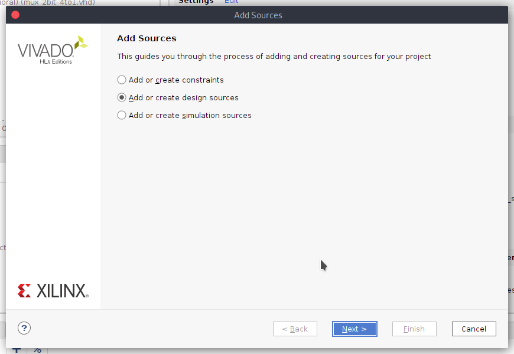

# Lab assignment 03- Vivado

Link to my repository: [Rohal(221066)/Digital-electronics-1](https://github.com/221066/Digital-electronics-1)

## 1. Preparation task

### Table  

| **LED** | **Connection** | **Switch** | **Connection** | 
| :-: | :-: | :-: | :-: |
| LED0 | H17 | SW0 | J15 |
| LED1 | K15 | SW1 | L16 |
| LED2 | J13 | SW2 | M13 |
| LED3 | N14 | SW3 | R15 |
| LED4 | R18 | SW4 | R17 |
| LED5 | V17 | SW5 | T18 |
| LED6 | U17 | SW6 | U18 |
| LED7 | U16 | SW7 | R13 |
| LED8 | V16 | SW8 | T8 |
| LED9 | T15 | SW9 | U8 |
| LED10 | U14 | SW10 | R16 |
| LED11 | T16 | SW11 | T13 |
| LED12 | V15 | SW12 | H6 |
| LED13 | V14 | SW13 | U12 |
| LED14 | V12 | SW14 | U11 |
| LED15 | V11 | SW15 | V10 |

## 2. Multiplexer

### Architecture (`mux_2bit_4to1.vhd`)

```vhdl
entity mux_2bit_4to1.vhd is
    port(
        a_i           : in  std_logic_vector(2 - 1 downto 0);
        b_i           : in  std_logic_vector(2 - 1 downto 0);
        c_i           : in  std_logic_vector(2 - 1 downto 0);
        d_i           : in  std_logic_vector(2 - 1 downto 0);
        sel_i         : in  std_logic_vector(2 - 1 downto 0);
        f_o           : out  std_logic_vector(2 - 1 downto 0)
              );
end entity mux_2bit_4to1.vhd;

architecture Behavioral of cmux_2bit_4to1.vhd is
begin
    
    f_o <= a_i when (sel_i = "00") else  
           b_i when (sel_i = "01") else
           c_i when (sel_i = "10") else
           d_i;
   
end architecture Behavioral;
```

### Stimulus process (`tb_mux_2bit_4to1.vhd`)

```vhdl
    p_stimulus : process
    begin
        -- Report a note at the begining of stimulus process
        report "Stimulus process started" severity note;

        s_d <= "00"; s_c <= "00"    ; s_b <= "00"; s_a <= "00";
        s_sel <= "00"; wait for 100 ns;
        
        s_d <= "00"; s_c <= "10"    ; s_b <= "01"; s_a <= "11";
        s_sel <= "01"; wait for 100 ns;
        
        s_d <= "01"; s_c <= "01"    ; s_b <= "10"; s_a <= "00";
        s_sel <= "10"; wait for 100 ns;
        
        s_d <= "10"; s_c <= "00"    ; s_b <= "11"; s_a <= "10";
        s_sel <= "11"; wait for 100 ns;
        
        s_d <= "11"; s_c <= "10"    ; s_b <= "11"; s_a <= "00";
        s_sel <= "00"; wait for 100 ns;
        
        s_d <= "01"; s_c <= "10"    ; s_b <= "01"; s_a <= "10";
        s_sel <= "01"; wait for 100 ns;
        
        s_d <= "11"; s_c <= "01"    ; s_b <= "00"; s_a <= "11";
        s_sel <= "10"; wait for 100 ns;
        
        s_d <= "11"; s_c <= "10"    ; s_b <= "11"; s_a <= "11";
        s_sel <= "11"; wait for 100 ns;
        
        -- Report a note at the end of stimulus process
        report "Stimulus process finished" severity note;
        wait;
    end process p_stimulus;
```

### Simulated Time Waveforms


## 3. A Vivado Tutorial

### Create a new project

1.Create project


2.Enter project name and poject location.


3.Select RTL Project.


4.Create new file. Select VHDL type. Enter file name and click OK.


5.Select Boards on the top bar.


6.Choose Nexys4 DDR and click Next >.


7.Ignore error and click Finish.


### Creation of Simulation Sources

1.Click on File and choose Add Source


2.Select Add or create design sources



3.Create File. Choose VHDL type and type testbench's name.

 

4.Click on Finish


### Start sumulation

Click on "Run simulation" at the left boxbar and choose first option.
