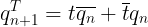
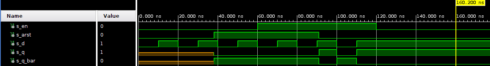
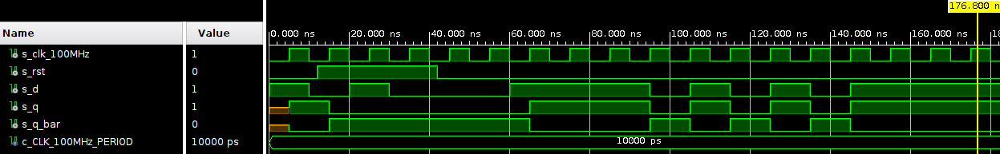
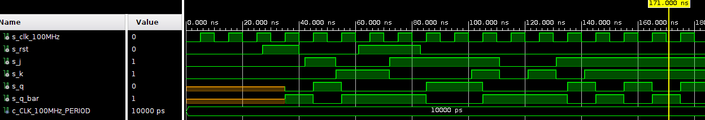
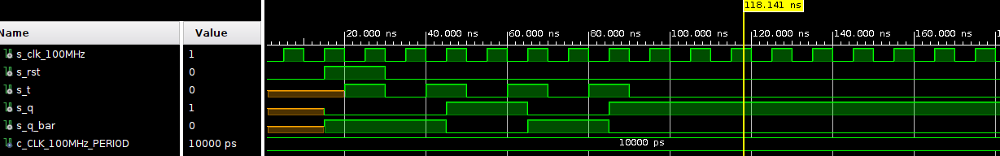

# Lab assignment 07-Latches & Flip-Flops

Link to my repository: [Rohal(221066)/Digital-electronics-1](https://github.com/221066/Digital-electronics-1)

## 1. Preparation tasks 

### Characteristic equations and completed tables for D, JK, T flip-flops




### Table for D_ff

| **clk** | **d** | **q(n)** | **q(n+1)** | **Comments** |
| :-: | :-: | :-: | :-: | :-- |
|  | 0 | 0 | 0 | No change |
|  | 0 | 1 | 0 | Store |
|  | 1 | 0 | 1 | Store |
|  | 1 | 1 | 1 | No change |

### Table for JK_ff

| **clk** | **j** | **k** | **q(n)** | **q(n+1)** | **Comments** |
| :-: | :-: | :-: | :-: | :-: | :-- |
|  | 0 | 0 | 0 | 0 | No change |
|  | 0 | 0 | 1 | 1 | No change |
|  | 0 | 1 | 0 | 0 | Reset |
|  | 0 | 1 | 1 | 0 | Reset |
|  | 1 | 0 | 0 | 1 | Set |
|  | 1 | 0 | 1 | 1 | Set |
|  | 1 | 1 | 0 | 1 | Toggle |
|  | 1 | 1 | 1 | 0 | Toggle |

### Table for T_ff

| **clk** | **t** | **q(n)** | **q(n+1)** | **Comments** |
| :-: | :-: | :-: | :-: | :-- |
|  | 0 | 0 | 0 | No change |
|  | 0 | 1 | 1 | No change |
|  | 1 | 0 | 1 | Invert(Toggle) |
|  | 1 | 1 | 0 | Invert(Toggle) |

## 2. D latch

### VHDL code of (`d_latch`)

```vhdl
  p_d_latch : process (d, arst, en)
  begin
      if (arst = '1') then
          q     <= '0';
          q_bar <= '1';
            
      elsif (en = '1') then
          q     <= d;
          q_bar <= not d;
      end if;
  end process p_d_latch;
```
### VHDL code of (`tb_d_latch.vhd`)

```vhdl
  p_reset_gen : process
    begin
        s_arst <= '0';
        wait for 38 ns;
        
        -- Reset activated
        s_arst <= '1';
        wait for 53 ns;

        -- Reset deactivated
        s_arst <= '0';
        
        wait for 300 ns;
        s_arst <= '1';

        wait;
    end process p_reset_gen;

    p_stimulus  : process
    begin
    report "Stimulus process started" severity note;
    s_d  <= '0';
    s_en <= '0';
    
    assert(s_q = '0')
    report "Error" severity error;
    
    wait for 10 ns;
    s_d  <= '1';
    wait for 10 ns;
    s_d  <= '0';
    wait for 10 ns;
    s_d  <= '1';
    wait for 10 ns;
    s_d  <= '0';
    wait for 10 ns;
    s_d  <= '1';
    wait for 10 ns;
    s_d  <= '0';
    
    assert(s_q = '0' and s_q_bar = '1')
    report "Error" severity error;
    
    s_en <= '1';
    
    wait for 10 ns;
    s_d  <= '1';
    wait for 10 ns;
    s_d  <= '0';
    wait for 10 ns;
    s_d  <= '1';
    wait for 10 ns;
    s_d  <= '0';
    wait for 10 ns;
    s_d  <= '1';
    wait for 10 ns;
    s_en  <= '0';  
    wait for 200 ns;
    s_d  <= '0';    

    wait for 10 ns;
    s_d  <= '1';
    wait for 10 ns;
    s_d  <= '0';
    wait for 10 ns;
    s_d  <= '1';
    wait for 10 ns;
    s_d  <= '0';
    wait for 10 ns;
    s_d  <= '1';
    wait for 10 ns;
    s_d  <= '0';
   
    wait for 10 ns;
    s_d  <= '1';
    wait for 10 ns;
    s_d  <= '0';
    wait for 10 ns;
    s_d  <= '1';
    wait for 10 ns;
    s_d  <= '0';
    wait for 10 ns;
    s_d  <= '1';
    wait for 10 ns;
    s_d  <= '0';
    
    
    report "Stimulus process finished" severity note;
    wait;
    end process p_stimulus;
```

### Waveforms



## 3. Flip-flops

### VHDL code of (`d_ff_arst`)

```vhdl
  p_d_ff_arst : process (clk,arst)
  begin
      if (arst = '1') then
          q     <= '0';
          q_bar <= '1';
            
      elsif rising_edge(clk) then
          q     <= d;
          q_bar <= not d;
      end if;
  end process p_d_ff_arst
```

### VHDL code of (`d_ff_rst`)

```vhdl
  p_d_ff_rst : process (clk)             
  begin
      if rising_edge(clk) then
          if (rst = '1') then
              q     <= '0';
              q_bar <= '1';
          else
              q     <= d;
              q_bar <= not d;
          end if; 
      end if;
  end process p_d_ff_rst;
```

### VHDL code of (`jk_ff_rst`)

```vhdl
  p_jk_ff_rst : process (clk)             
  begin                                         
    if rising_edge(clk) then 
        if (rst = '1') then
            s_q <= '0';
        else
               if (j = '0' and k = '0') then
                s_q  <=  s_q;
               
            elsif (j = '0' and k = '1') then
                s_q  <=  '0';
               
            elsif (j = '1' and k = '0') then
                s_q  <=  '1';
               
            elsif (j = '1' and k = '1') then                   
                s_q  <=  not s_q; 
                
            end if; 
          end if;                   
      end if;                                   
  end process p_jk_ff_rst;
```

### VHDL code of (`t_ff_rst`)

```vhdl
  p_t_ff_rst : process (clk)
  begin
      if rising_edge(clk) then
          if (rst = '1') then
              s_q     <=  '0';
              s_q_bar <=  '1';
          else
              if (t = '0') then
                  s_q     <=   s_q;
                  s_q_bar <=   s_q_bar;
              else
                  s_q     <=  not s_q;
                  s_q_bar <=  not s_q_bar;
              end if;    
          end if;
      end if;
  end process p_t_ff_rst;
```

### (`tb_d_ff_arst`)

```vhdl
p_clk_gen : process
        begin
            while now < 750 ns loop         -- 75 periods of 100MHz clock
                s_clk_100MHz <= '0';
                wait for c_CLK_100MHz_PERIOD / 2;
                s_clk_100MHz <= '1';
                wait for c_CLK_100MHz_PERIOD / 2;
            end loop;
            wait;
        end process p_clk_gen;
    ------------------------------------------
    --Reset generation process
    ------------------------------------------    
     p_reset_gen : process
        begin
            s_arst <= '0';
            wait for 31 ns;
            
            s_arst <= '1';
            wait for 16 ns;
    
            s_arst <= '0';
            
            wait for 20 ns;
            s_arst <= '1';
            
            wait for 36 ns;
            s_arst <= '0';
            
            wait for 663 ns;
            s_arst <= '1';
    
            wait;
        end process p_reset_gen;

    ------------------------------------------
    --Data generation process
    ------------------------------------------ 
    p_stimulus : process
    begin
        report "Stimulus process started" severity note;
        s_d <= '0';

        wait for 14 ns;
        s_d  <= '1';
        wait for 10 ns;
        s_d  <= '0';
        
        wait for 6 ns;

        wait for 4 ns;
        s_d  <= '1';
        wait for 10 ns;
        s_d  <= '0';
        wait for 10 ns;
        s_d  <= '1';
        wait for 10 ns;
        s_d  <= '0';   

        wait for 10 ns;
        s_d  <= '1';
        wait for 10 ns;
        s_d  <= '0';
        wait for 10 ns;
        s_d  <= '1';
        wait for 10 ns;
        s_d  <= '0';
        wait for 10 ns;
        s_d  <= '1';
        wait for 10 ns;
        s_d  <= '0';   
        
    report "Stimulus process finished" severity note;
    wait;
    end process p_stimulus;
```

### (`tb_d_ff_rst`)

```vhdl
 p_clk_gen : process
        begin
            while now < 750 ns loop         -- 75 periods of 100MHz clock
                s_clk_100MHz <= '0';
                wait for c_CLK_100MHz_PERIOD / 2;
                s_clk_100MHz <= '1';
                wait for c_CLK_100MHz_PERIOD / 2;
            end loop;
            wait;
        end process p_clk_gen;
        
    ------------------------------------------
    --Reset generation process
    ------------------------------------------    
     p_reset_gen : process
        begin
            s_rst <= '0';
            wait for 12 ns;

            s_rst <= '1';
            wait for 30 ns;

            s_rst <= '0';
            wait;
        end process p_reset_gen;
        
    ------------------------------------------
    --Data generation process
    ------------------------------------------ 
    p_stimulus : process
    begin
        report "Stimulus process started" severity note;
        s_d <= '1';
        
        wait for 10 ns;
        s_d  <= '0';
        wait for 10 ns;
        s_d  <= '1';        
        wait for 10 ns;
        s_d  <= '0';
        wait for 10 ns;
        
        assert(s_q = '0' and s_q_bar = '1')
        report "Error - Failed" severity error;
        
        wait for 20 ns;
        s_d  <= '1';
        wait for 25 ns;
        
        assert(s_q = '1' and s_q_bar = '0')
        report "Error - Failed" severity error;

        wait for 10 ns;
        s_d  <= '0';
        wait for 10 ns;
        s_d  <= '1';
        wait for 10 ns;
        s_d  <= '0';
        wait for 10 ns;
        s_d  <= '1';
        wait for 10 ns;
        s_d  <= '0';
        wait for 10 ns;
        s_d  <= '1';   
        
    report "Stimulus process finished" severity note;
    wait;
    end process p_stimulus;        
```

### (`tb_jk_ff_rst`)

```vhdl
 p_reset_gen : process
     begin
         s_rst <= '0';
         wait for 30 ns;
         
         -- Reset activated
         s_rst <= '1';
         wait for 16 ns;
 
         -- Reset deactivated
         s_rst <= '0';
         
         wait for 21 ns;
         s_rst <= '1';
         
         wait for 22 ns;
         s_rst <= '0';
         
         wait for 660 ns;
         s_rst <= '1';
 
         wait;
     end process p_reset_gen;

 ------------------------------------------
 --Data generation process
 ------------------------------------------    
 p_stimulus : process
 begin
     report "Stimulus process started" severity note;
     s_j <= '0';
     s_k <= '0';
     
     wait for 15 ns;
     s_j <= '0';
     s_k <= '0';        
     wait for 27 ns;
     s_j <= '1';
     s_k <= '0';                       
     wait for 11 ns;
     s_j <= '0';
     s_k <= '1';        
     wait for 19 ns;
     s_j <= '1';
     s_k <= '0';       
     wait for 29 ns;
     s_j <= '1';
     s_k <= '1';

     wait for 10 ns;
     s_j <= '0';
     s_k <= '0';             
     wait for 10 ns;
     s_j <= '0';
     s_k <= '1';     
     wait for 10 ns;
     s_j <= '1';
     s_k <= '0';     
     wait for 10 ns;
     s_j <= '1';
     s_k <= '1';
     
     report "Stimulus process finished" severity note;
     wait;
 end process p_stimulus;
```

### (`tb_t_ff_rst`)

```vhdl
p_reset_gen : process
        begin
            s_rst <= '0';
            wait for 15 ns;

            s_rst <= '1';
            wait for 15 ns;

            s_rst <= '0';
            wait;
        end process p_reset_gen;
        
    ------------------------------------------
    --Data generation process
    ------------------------------------------ 
    p_stimulus : process
    begin
        report "Stimulus process started" severity note;

        wait for 20 ns;
        s_t <= '1';  
        wait for 10 ns;
        s_t <= '0';                       
        wait for 10 ns;
        s_t <= '1';        
        wait for 10 ns;
        s_t <= '0';       
        wait for 10 ns;
        s_t <= '1';
        wait for 10 ns;
        s_t <= '0';
        wait for 10 ns;
        s_t <= '1';
        wait for 10 ns;
        s_t <= '0';

        assert(s_q='1' and s_q_bar = '0')
        report "Error" severity error;
            
        report "Stimulus process finished" severity note;
        wait;
    end process p_stimulus;
```

### Waveforms (`d_ff_arst.vhd`)


### Waveforms (`d_ff_rst.vhd`)



### Waveforms (`jk_ff_rst.vhd`)



### Waveforms (`t_ff_rst.vhd`)



## 4. Shift register 


