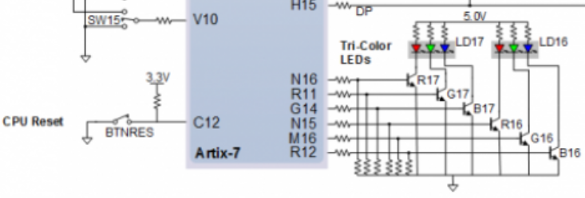
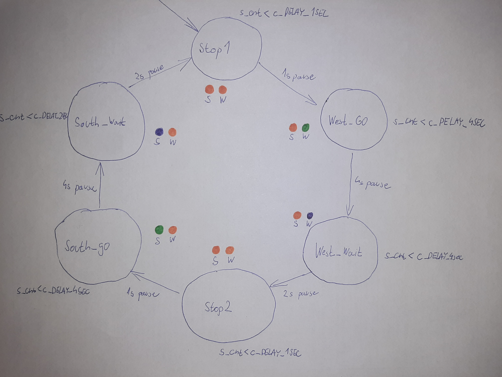
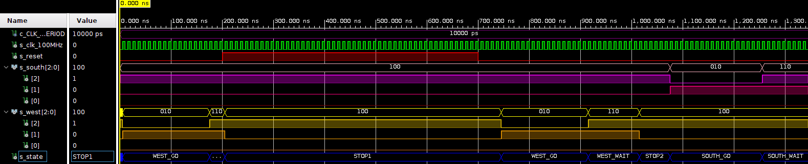
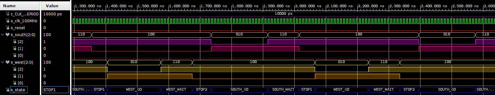
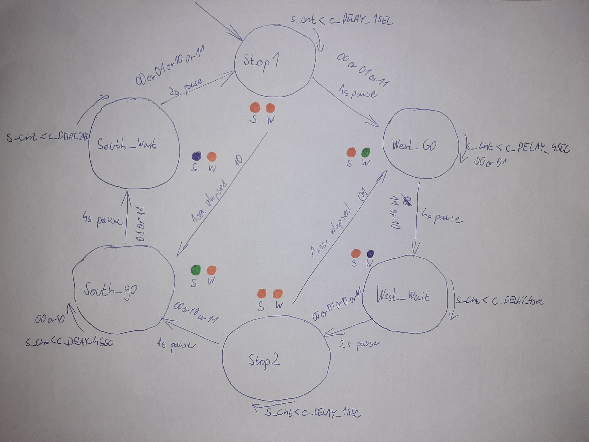

# Lab assignment 08- Traffic light controller

Link to my repository: [Rohal(221066)/Digital-electronics-1](https://github.com/221066/Digital-electronics-1)

## 1. Preparation tasks

### State table  

| **Input P** | `0` | `0` | `1` | `1` | `0` | `1` | `0` | `1` | `1` | `1` | `1` | `0` | `0` | `1` | `1` | `1` |
| :-- | :-: | :-: | :-: | :-: | :-: | :-: | :-: | :-: | :-: | :-: | :-: | :-: | :-: | :-: | :-: | :-: |
| **Clock** |  |  |  |  |  |  |  |  |  |  |  |  |  |  |  |  |
| **State** | A | A | B | C | C | D | A | B | C | D | B | B | B | C | D | B |
| **Output R** | `0` | `0` | `0` | `0` | `0` | `1` | `0` | `0` | `0` | `1` | `0` | `0` | `0` | `0` | `1` | `0` |

### Figure with connection of RGB LEDs on Nexys A7 board



### Table with color settings

| **RGB LED** | **Artix-7 pin names** | **Red** | **Yellow** | **Green** |
| :-: | :-: | :-: | :-: | :-: |
| LD16 | N15, M16, R12 | `1,0,0` | `1,1,0` | `0,1,0` |
| LD17 | N16, R11, G14 | `1,0,0` | `1,1,0` | `0,1,0` |

## 2. Traffic light controller

### State diagram



### Listing of VHDL code of (`p_traffic_fsm`)

```vhdl
    p_traffic_fsm : process(clk)
    begin
        if rising_edge(clk) then
            if (reset = '1') then       -- Synchronous reset
                s_state <= STOP1 ;      -- Set initial state
                s_cnt   <= c_ZERO;      -- Clear all bits

            elsif (s_en = '1') then

                case s_state is

                    when STOP1 =>
                        if (s_cnt < c_DELAY_1SEC) then
                            s_cnt <= s_cnt + 1;
                        else
                            s_state <= WEST_GO;
                            s_cnt   <= c_ZERO;
                        end if;

                    when WEST_GO =>
                           if( s_cnt < c_DELAY_4SEC) then
                              s_cnt <= s_cnt + 1;
                           else
                              s_state <= WEST_WAIT;
                              s_cnt <= c_ZERO;  
                           end if;
                    
                    when WEST_WAIT =>
                        if (s_cnt <= c_DELAY_2SEC) then 
                            s_cnt <= s_cnt + 1;
                        else
                            s_state <= STOP2;
                            s_cnt <= c_ZERO;
                        end if;  
   
                    when STOP2 =>
                        if (s_cnt <= c_DELAY_1SEC) then 
                            s_cnt <= s_cnt + 1;
                        else
                            s_state <= SOUTH_GO;
                            s_cnt <= c_ZERO;
                        end if;
                        
                    when SOUTH_GO =>
                        if (s_cnt <= c_DELAY_4SEC) then 
                            s_cnt <= s_cnt + 1;
                        else
                            s_state <= SOUTH_WAIT;
                            s_cnt <= c_ZERO;
                        end if;
                        
                    when SOUTH_WAIT =>
                        if (s_cnt <= c_DELAY_2SEC) then 
                            s_cnt <= s_cnt + 1;
                        else
                            s_state <= STOP1;
                            s_cnt <= c_ZERO;
                        end if;                           
                
                    when others =>
                        s_state <= STOP1;

                end case;
            end if; -- Synchronous reset
        end if; -- Rising edge
    end process p_traffic_fsm;
```

### Listing of VHDL code of (`p_output_fsm`)

```vhdl
    p_output_fsm : process(s_state)
    begin
        case s_state is
            when STOP1 =>
                south_o <= "100";   -- Red (RGB = 100)
                west_o  <= "100";   -- Red (RGB = 100)
            when WEST_GO =>
            
                south_o <= "100";   -- Red (RGB = 100)
                west_o  <= "010";   -- Green (RGB = 010)
            when WEST_WAIT =>
            
                south_o <= "100";   -- Red (RGB = 100)
                west_o  <= "110";   -- Orange (RGB = 110)
            when STOP2 =>
            
                south_o <= "100";   -- Red (RGB = 100)
                west_o  <= "100";   -- Red (RGB = 100)
                
            when SOUTH_GO =>
                south_o <= "010";   -- Green (RGB = 010)
                west_o  <= "100";   -- Red (RGB = 100)
                
            when SOUTH_WAIT =>
                south_o <= "110";   -- Orange (RGB = 110)
                west_o  <= "100";   -- Red (RGB = 100)
            
            when others =>
                south_o <= "100";   -- Red (RGB = 100)
                west_o  <= "100";   -- Red (RGB = 100)
        end case;
    end process p_output_fsm;
```

### Waveforms





## 3. Smart controller

### State table


| Current state | Direction South | Direction West | Delay | No Cars (`00`) | Cars to West (`01`) | Cars to South (`10`) | Cars Both Directions (`11`) |
| :-----------: | :-------------: | :------------: | ----- | :------------: | :-----------------: | :------------------: | :-------------------------: |
|    `STOP1`    |       red       |      red       | 1 sec |   `WEST_GO`    |      `WEST_GO`      |      `SOUTH_GO`      |          `WEST_GO`          |
|   `WEST_GO`   |       red       |     green      | 4 sec |   `WEST_GO`    |      `WEST_GO`      |     `WEST_WAIT`      |         `WEST_WAIT`         |
|  `WEST_WAIT`  |       red       |     yellow     | 2 sec |    `STOP2`     |       `STOP2`       |       `STOP2`        |           `STOP2`           |
|    `STOP2`    |       red       |      red       | 1 sec |   `SOUTH_GO`   |      `WEST_GO`      |      `SOUTH_GO`      |         `SOUTH_GO`          |
|  `SOUTH_GO`   |      green      |      red       | 4 sec |   `SOUTH_GO`   |    `SOUTH_WAIT`     |      `SOUTH_GO`      |        `SOUTH_WAIT`         |
| `SOUTH_WAIT`  |     yellow      |      red       | 2 sec |    `STOP1`     |       `STOP1`       |       `STOP1`        |           `STOP1`           |

### State diagram



### Listing of VHDL code (`p_smart_traffic_fsm`)

```vhdl
  p_smart_traffic_fsm : process(clk)
  begin
      if rising_edge(clk) then
          if (reset = '1') then       -- Synchronous reset
              s_state <= STOP1 ;      -- Set initial state
              s_cnt   <= c_ZERO;      -- Clear all bits

          elsif (s_en = '1') then

              case s_state is

                  when STOP1 =>
                      if (s_cnt < c_DELAY_1SEC) then
                          s_cnt <= s_cnt + 1;
                      else
                          if (sensors = "10") then
                              s_state <= SOUTH_GO;
                              s_cnt   <= c_ZERO;
                          else
                              s_state <= WEST_GO;
                              s_cnt   <= c_ZERO;
                          end if;
                      end if;

                  when WEST_GO =>
                        
                      if (s_cnt < c_DELAY_4SEC) then
                          s_cnt <= s_cnt + 1;
                      else
                          if (sensors = "00" or sensors = "01") then
                              s_state <= WEST_GO;
                              s_cnt   <= c_ZERO;
                          else
                              s_state <= WEST_WAIT;
                              s_cnt   <= c_ZERO;
                          end if;
                      end if;

                  when WEST_WAIT =>
                        
                      if (s_cnt < c_DELAY_2SEC) then
                          s_cnt <= s_cnt + 1;
                      else
                          s_state <= STOP2;
                          s_cnt   <= c_ZERO;   
                      end if;
                        
                  when STOP2 =>
                        
                      if (s_cnt < c_DELAY_1SEC) then
                          s_cnt <= s_cnt + 1;
                      else
                          if (sensors = "01") then
                              s_state <= WEST_GO;
                              s_cnt   <= c_ZERO;
                          else
                              s_state <= SOUTH_GO;
                              s_cnt   <= c_ZERO;
                          end if;
                      end if;
                        
                  when SOUTH_GO =>
                        
                      if (s_cnt < c_DELAY_4SEC) then
                          s_cnt <= s_cnt + 1;
                      else
                          if (sensors = "10" or sensors = "00") then
                              s_state <= SOUTH_GO;
                              s_cnt   <= c_ZERO;
                          else
                              s_state <= SOUTH_WAIT;
                              s_cnt   <= c_ZERO;
                          end if;
                      end if;
                        
                  when SOUTH_WAIT =>
                       
                     if (s_cnt < c_DELAY_2SEC) then
                         s_cnt <= s_cnt + 1;
                     else
                         s_state <= STOP1;
                         s_cnt   <= c_ZERO;
                     end if;

                  when others =>
                      s_state <= STOP1;

              end case;
          end if; -- Synchronous reset
      end if; -- Rising edge
  end process p_smart_traffic_fsm;
```
